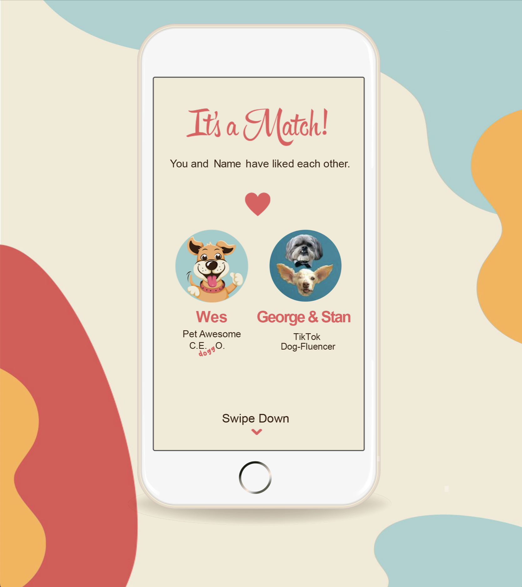
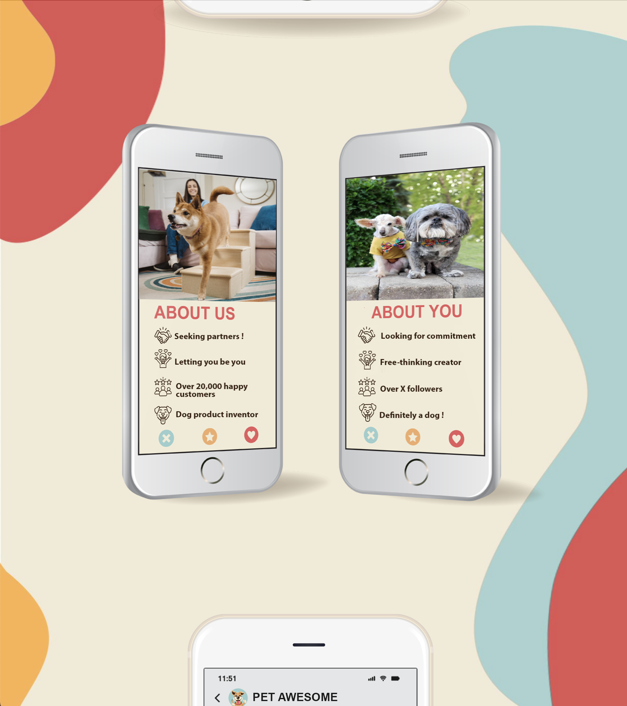
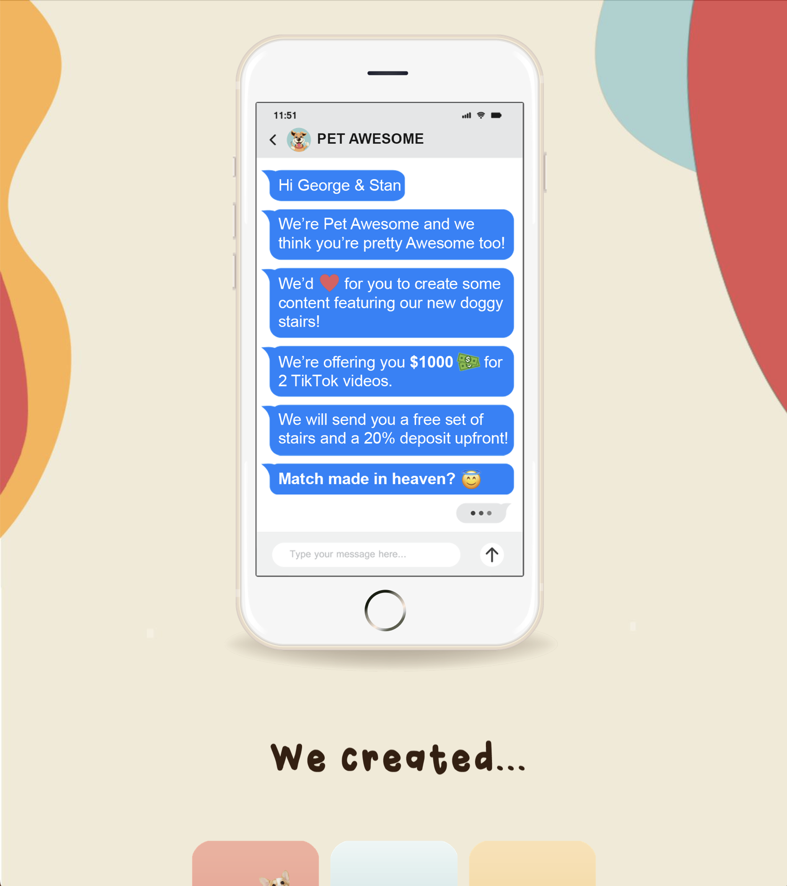
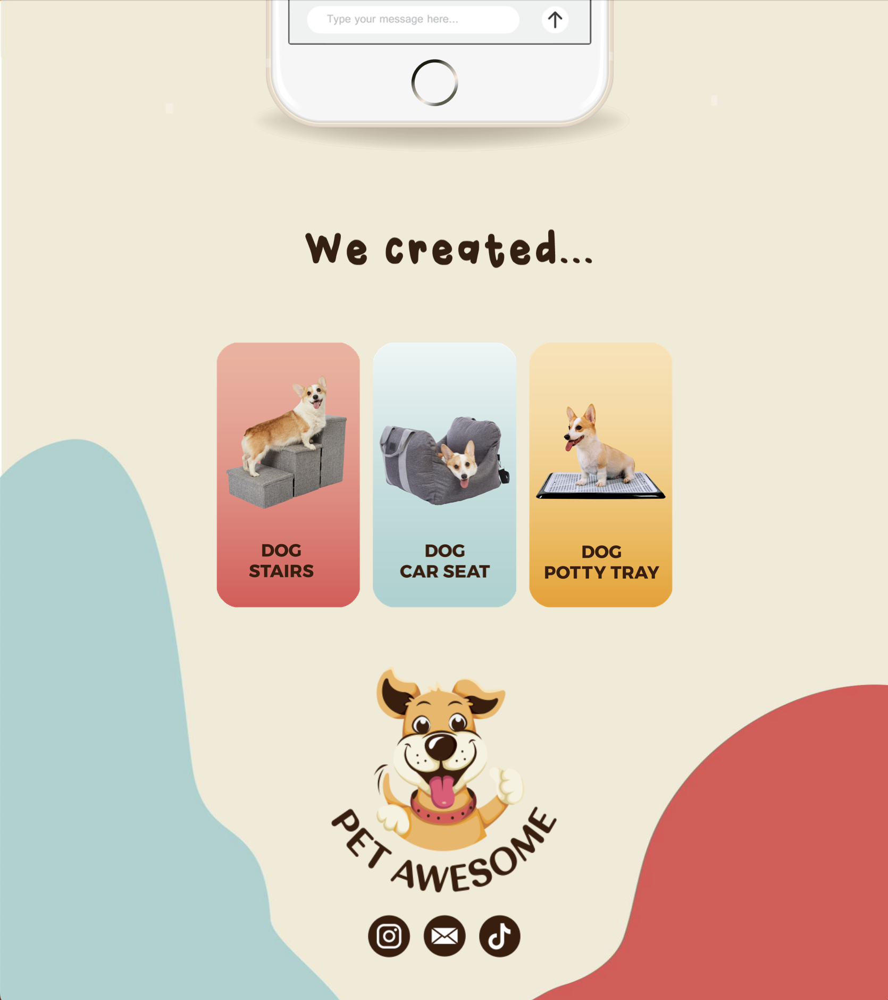

# Pet-Awesome Marketing Email

* I was hired to design and build this marketing email for **Pet-Awesome** Pet Products. 
* I used **html** and **CSS** to complete the marketing email.
* The email was needed for the purposes of connecting with social media influencers in order to create brand marketing relationships
* The email should display in the browser through GitHub Pages here: **<https://gaberull.github.io>**

## Process for emailing from gmail and chrome:
1. copy html document from plain text editor
2. Open gmail
3. Insert some placeholder text like "PPP" into email body
4. Highlight placeholder text. Right click on it and click inspect.
5. On the highlighted portion in the chrome dev tools, right click, click edit as html
6. find placeholder text and carefully replace with pasted html code.
7. Send email

*** Note: I had to move the background from the body tag or it wouldn't show up in email. I put it in the table element that body enclosed. 

## Screenshots of Finished Product
These were taken using Safari on MacOS

