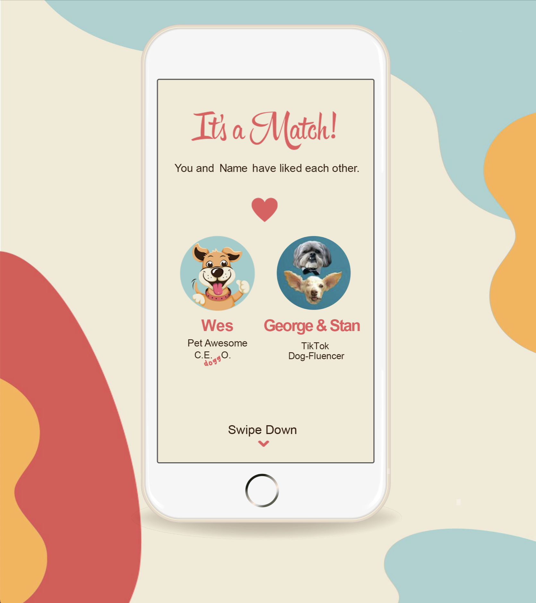
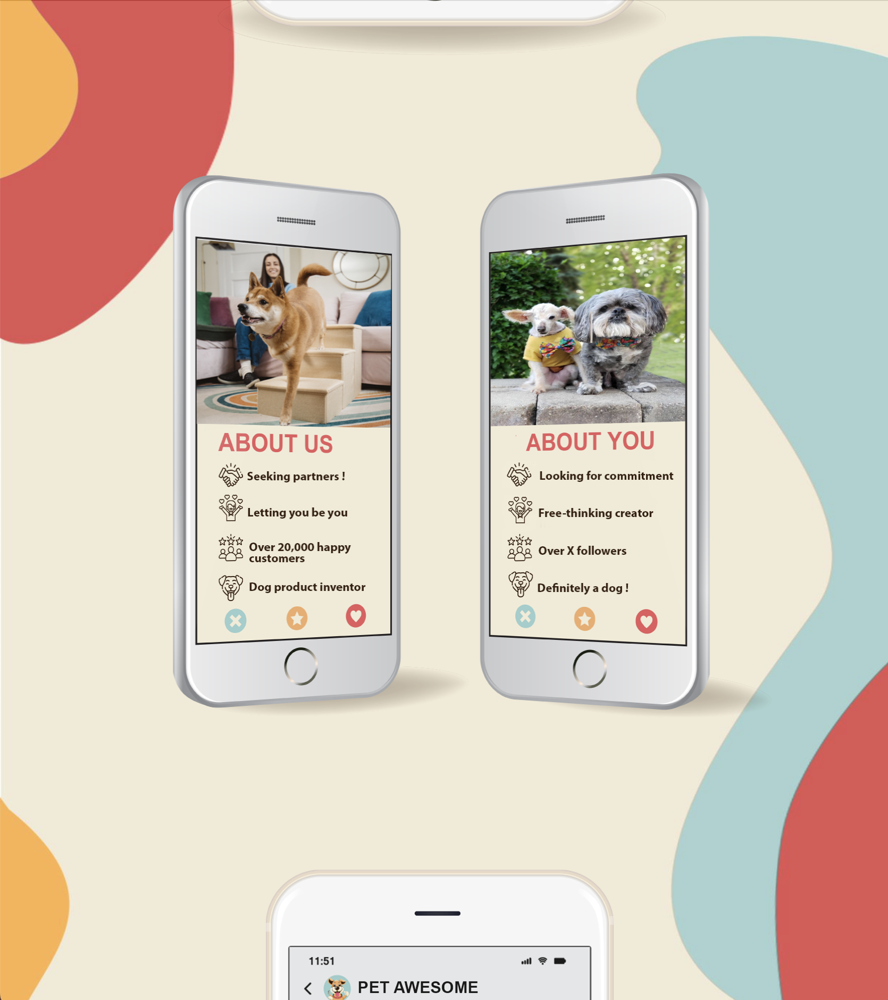
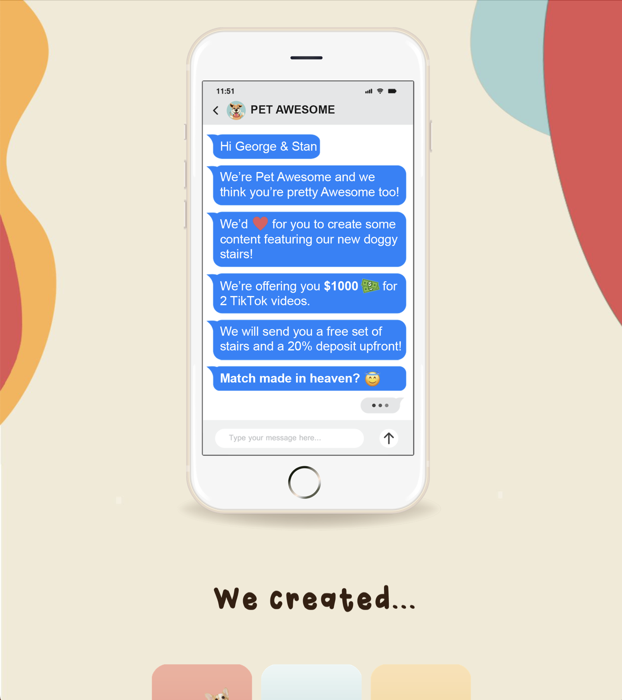
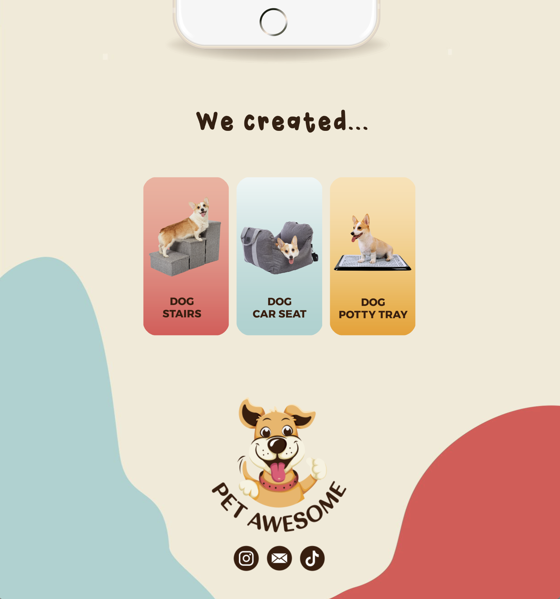

# Pet-Awesome Marketing Email

## Summary

* I was hired to design and build email templates like this marketing email for **Pet-Awesome** Pet Products. 
* I used **html** and **CSS** to complete the marketing email.
* The email template is currently being used for the purposes of connecting with social media influencers in order to create brand marketing relationships
* Some of my earlier work on this project is in a different repository of mine. I moved it to this one to make use of the GitHub Pages domain name
    - **[PetAwesomeEmail Repository](https://github.com/gaberull/PetAwesomeEmail)**
* The email should display in the browser through GitHub Pages here: 
    - **<https://gaberull.github.io>**

## Process for emailing from gmail and chrome:
1. copy text of entire html document from plain text editor
2. Open gmail
3. Insert some placeholder text like "PPP" into email body
4. Highlight placeholder text. Right click on it and click inspect.
5. On the highlighted portion in the chrome developer tools, right click, then click edit as html
6. find placeholder text and carefully replace with pasted email template code.
7. Send email

## Screenshots of Finished Product

These were captured using Safari on MacOS

